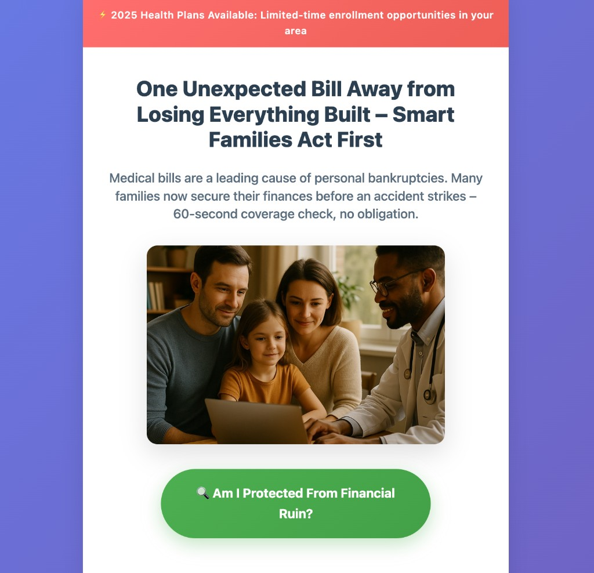
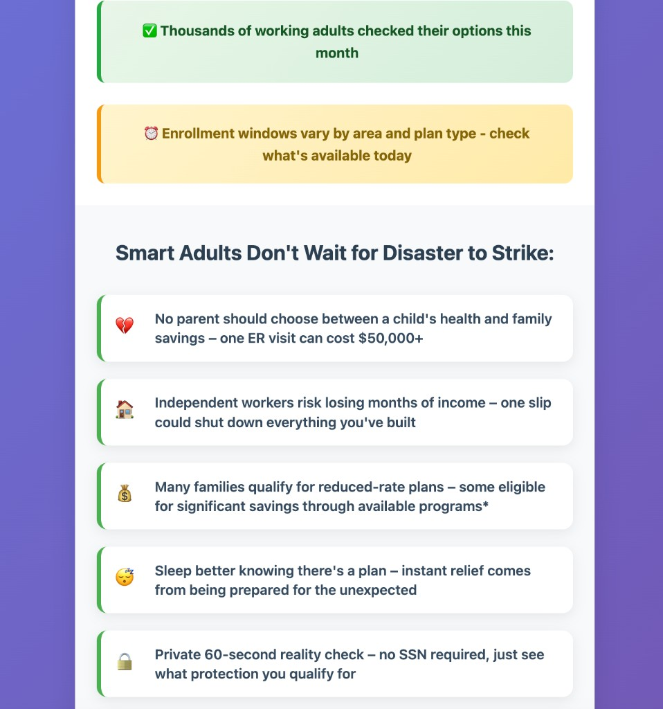
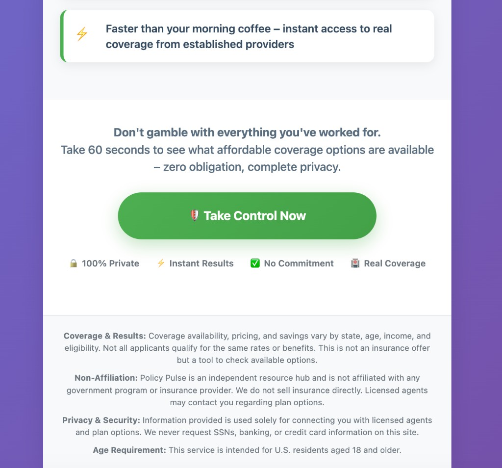
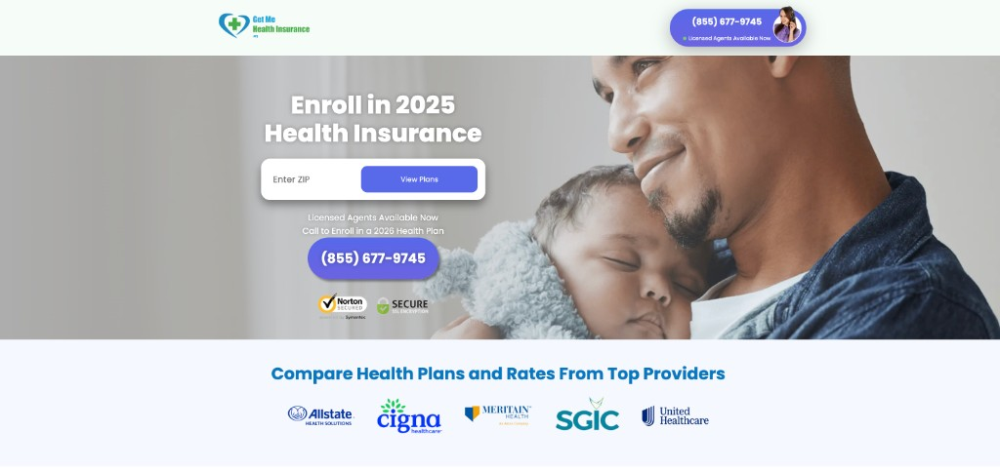
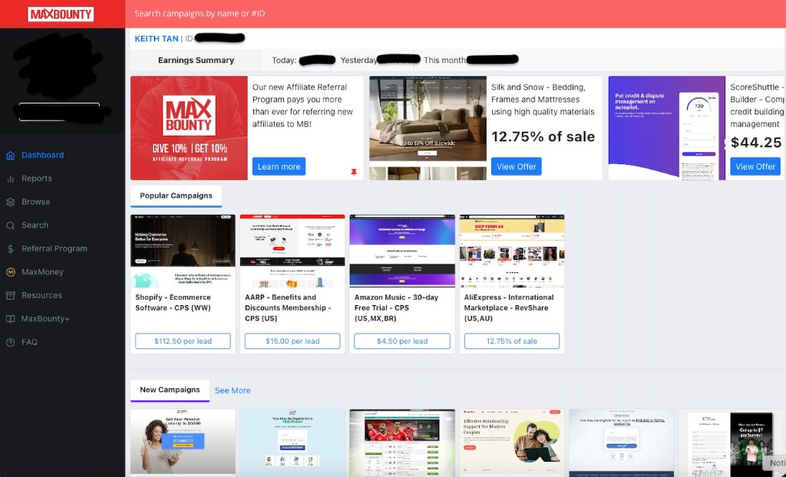
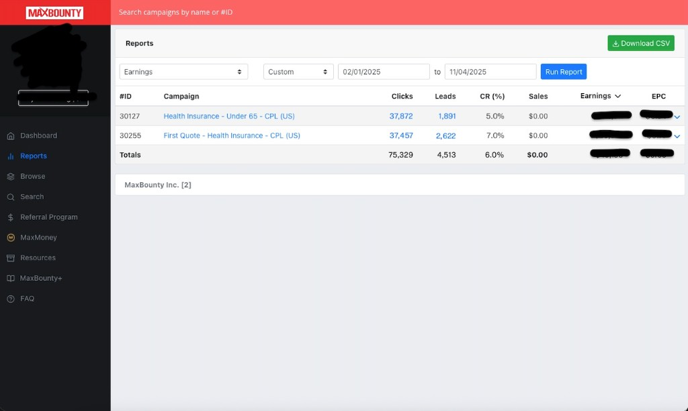

# Policy Pulse

A **health insurance lead-gen prelander**: the step between your Facebook ad and the client's landing page. Ad click → short "reality check" here → one click through to the offer (ZIP, plans, call). **End-to-end tracking** so every step is measurable and attributable.

Vanilla HTML/CSS/JS and Netlify serverless functions—no framework, easy to read and deploy.

---

## What it does

1. **User clicks your ad** → Lands on this prelander (headline, benefits, main button).
2. **User clicks the button** → Your server resolves the offer URL, attaches tracking (fbp, fbc, user agent), and redirects. Meta can tie the visit to your ad.
3. **User converts on the client's page** → The affiliate network hits your postback; your server sends a Lead event to Meta. Attribution stays accurate.

**In one line:** Ad → prelander → offer page → conversion, with **tracking at every step**.

---

## What it looks like

The prelander (this repo) and the offer page it sends users to.

**Prelander (Policy Pulse)** — one page, three sections shown below:

| Hero — headline, social proof, main button | Benefits — urgency and value |
| ----------------------------------------- | ---------------------------- |
|  |  |

| Bottom — final CTA and disclaimers |
| ---------------------------------- |
|  |

**Client's landing page** (external)—e.g. enter ZIP, view plans, or call. Each qualified lead pays out per the offer; amount depends on the network.

| |
|--|
|  |

---

## How the flow works

```
┌─────────────┐     ┌──────────────────┐     ┌─────────────────────────┐     ┌──────────────┐
│  User      │     │  Prelander       │     │  Client's landing page   │     │  Conversion  │
│  clicks    │ ──► │  (this repo)    │ ──► │  (ZIP, view plans, call) │ ──► │  (e.g. lead) │
│  FB ad     │     │  Policy Pulse   │     │  external               │     │              │
└─────────────┘     └──────────────────┘     └─────────────────────────┘     └──────────────┘
        ▲                    │                          │                      │
        │                    ▼                          │                      │
        │            • Page view + CTA → Meta          │                      │
        │            • Bot checks, angle-based copy     │                      │
        │            • Server appends fbp/fbc, redirects│                      │
        │                                              ▼                      ▼
        │            ┌─────────────────────────────────────────────────────────────┐
        │            │  Network calls postback → server sends Lead to Meta CAPI    │
        │            │  → Algorithm gets conversion signal → better targeting      │
        │            └─────────────────────────────────────────────────────────────┘
        └──────────────────────────────────────────────────────────────────────────
```

**Plain terms:** Ad → prelander → offer → convert. Your server records each step and reports to Meta so the algorithm can optimize who sees your ad.

---

## Where this fits: leads and affiliate networks

**Affiliate networks** (e.g. MaxBounty) list offers—"$X per lead" or "Y% of sale"—and **affiliates** promote them and get paid per conversion. A **lead** is one completed action the advertiser pays for. The network tracks and pays; you bring traffic.

| Real MaxBounty dashboard | Real earnings report (this funnel) |
| ------------------------ | ---------------------------------- |
|  |  |

Left: the actual network dashboard. Right: earnings from running this health insurance prelander offer.

**Note:** The network gives you offers and payouts—not ad spend or infrastructure. You run your own landing pages, tracking, and ads (e.g. Facebook). This repo is the kind of infrastructure you need in the middle.

---

## Why tracking and quality matter

**Meta CAPI** — Events are sent **from your server** to Meta, not only from the browser. When users block cookies or use strict privacy settings, browser-only tracking drops conversions. Server-side events keep attribution working so Meta can see which ads drive leads and optimize delivery.

**Privacy-resilient** — Your server receives the request (IP, user agent, fbp/fbc when available) and forwards the event to CAPI. Blockers and cookie limits don’t break the pipeline; conversion data stays reliable.

**Bot and fraud** — Lead-gen attracts bots and junk traffic. This prelander uses **FingerprintJS BotD** plus behavior checks (dwell time, scroll, pointer movement, motion patterns) and honeypot fields. Suspect or bot traffic isn’t sent to Meta—so your stats stay usable and the algorithm isn’t trained on noise.

---

## Why this funnel is built this way

Built to **lower cost per lead** and **improve return on ad spend** without long forms. Design choices:

- **Low-friction CTA** — Copy frames the click as a small step (e.g. "60-second check, no obligation") so it feels low-risk.
- **Message match** — Same thread from ad → prelander → offer so intent doesn’t drop at the handoff.
- **Conversions train Meta** — CAPI sends conversions back; the algorithm learns who converts and targets similar users.
- **Behavior over forms** — Bot checks and engagement (time on page, scroll, click) filter quality without adding fields.

Config and copy variants are env-driven; the main button calls your server for the offer URL with tracking attached. On conversion, the network hits your postback and your server sends the Lead event to Meta. No secrets in the repo—everything via env vars (see Setup).

---

## Setup

### 1. Get the code

```bash
git clone https://github.com/peakvantagelabs-png/policyPulse.git
cd policyPulse
npm install
```

### 2. Environment variables

In **Netlify** (Site settings → Environment variables):

| Variable                | Description |
| ----------------------- | ----------- |
| `FACEBOOK_PIXEL_ID`     | Meta Pixel ID (Events Manager). |
| `FACEBOOK_ACCESS_TOKEN` | Server-side token for CAPI (e.g. System User with `ads_management`). |
| `OFFER_REDIRECT_URL`    | Affiliate/offer URL users are sent to on CTA click. |
| `SITE_URL`              | Site base URL (e.g. `https://your-site.netlify.app`). Optional. |
| `OFFER_FALLBACK_URL`    | Optional fallback if redirect fails. |

Local dev: copy `.env.example` to `.env` and set the same. Don’t commit `.env`.

### 3. Deploy

```bash
npx netlify deploy --prod
```

Confirm variables in the Netlify dashboard.

### 4. Affiliate network (e.g. MaxBounty)

When a user converts, the network must notify your server. In the campaign’s callback/postback settings, set the URL to:

`https://YOUR-SITE-URL/.netlify/functions/postback?s1=#S1#&s2=#S2#&s3=#S3#&s4=#S4#&s5=#S5#&OFFID=#OFFID#&IP=#IP#&RATE=#RATE#&SALE=#SALE#&CONVERSION_ID=#CONVERSION_ID#`

Replace `YOUR-SITE-URL` with your deployed domain. Your server maps s3→fbp, s4→fbc, s5→user agent so Meta can attribute the conversion.

---

## Tech stack

| Layer             | Choice |
| ----------------- | ------ |
| Frontend          | Vanilla HTML, CSS, JS (single page). |
| Hosting / backend | Netlify (static + serverless functions). |
| Tracking          | Meta Pixel + Conversions API (browser + server). |
| Bot / quality     | FingerprintJS BotD + behavior checks + honeypots. |

Structure: `index.html`, `assets/css/main.css`, `assets/js/` (app + bot detection), `netlify/functions/` (config, CAPI, redirect, postback). Env-driven; no secrets in repo.

---

## Testing

After deploy:

- **CAPI:** `GET https://your-site.netlify.app/.netlify/functions/test-capi`
- **Postback:** `GET https://your-site.netlify.app/.netlify/functions/test-postback`
- **Test events:** `GET https://your-site.netlify.app/.netlify/functions/test-facebook-events` (Events Manager → Test Events)

---

## License

Use and adapt as needed. No warranty.
